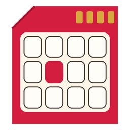
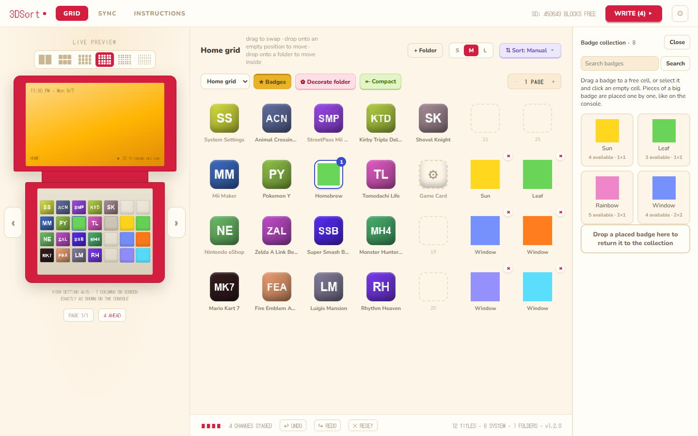
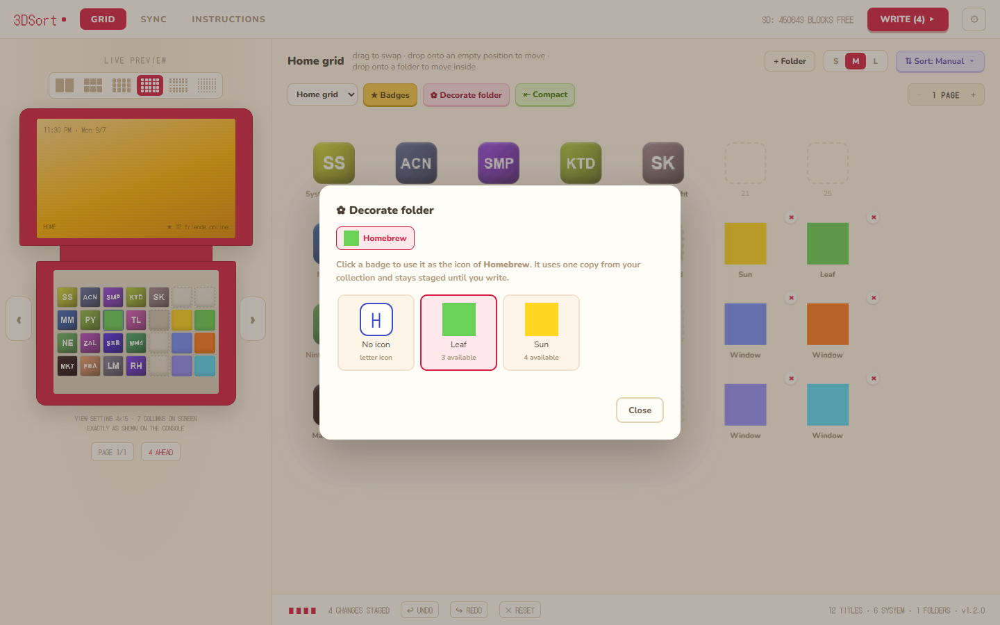
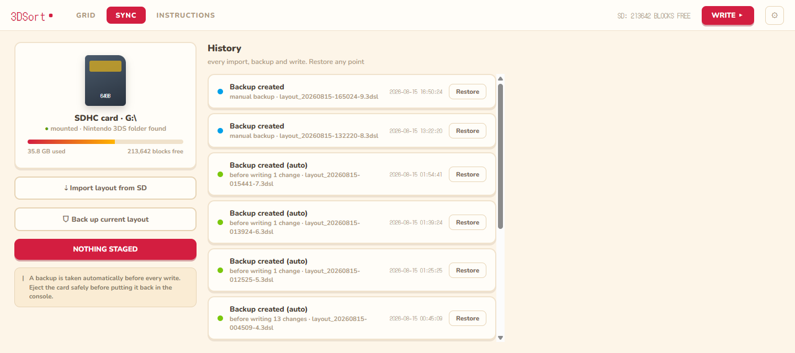
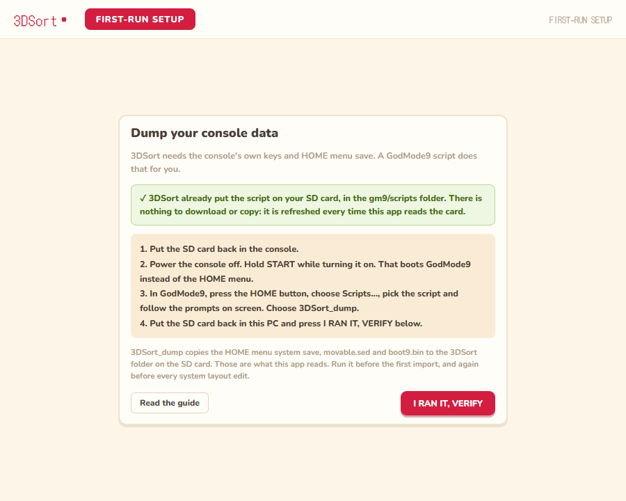

<div align="center">



# 3DSort

**Rearrange your Nintendo 3DS HOME menu from your PC.**

[](#running-from-source)
[](#running-from-source)
[](#tests)
[](#status)
[](LICENSE)
[](#status)

</div>

> [!NOTE]
> **Built with AI assistance.** Much of this code was written with Claude. The
> 3DS file formats were reverse engineered against real dumps, and every write
> path was validated on real consoles before release.

Organizing icons on the console itself is slow: one stylus drag at a time, page
by page. 3DSort edits the layout directly on the SD card instead. Put the card
in your computer, drag games, folders and badges around in a desktop app with a
live preview of the console screen, sort with one click, then write the result
back and boot the console.

**[Download the latest release](https://github.com/SalustLab/3DSort/releases/latest)**:
a portable `.exe` for Windows, a `3DSort.app` for Apple Silicon Macs and a
`tar.gz` for Linux. No installer and no Python needed.



> [!IMPORTANT]
> Every write takes an automatic backup first, and nothing touches the card
> until you confirm. When you move system apps or folders, do not boot the HOME
> menu between writing on the PC and running the inject script on the console.

## New in v1.2.0: badges and exact positions

- **Badges on the grid.** The collection installed on your card shows up in a
  panel: drag a badge onto any empty cell, move it, return it to the collection,
  or set it as a folder icon (from the Decorate button, the New folder dialog,
  or by dropping it on the folder's big icon inside the folder). Pieces of a big
  badge are placed one by one, exactly as the console does it.
- **Exact positions.** Empty cells are real: moving something leaves a gap, like
  on the console. Cells are numbered so you can match the grid to the screen.
- **Compact** closes the gaps of the current grid, keeping the order.
- **Sort presets** now lay the whole grid out: system apps, Game Card, folders
  and badges first, then the games sorted A to Z, Z to A or by release date.
- Staged changes are named ("Moved Mario Kart 7 to cell 124"), so the history in
  SYNC reads like a log.

Badges are the ones already in your collection; 3DSort does not install any.
Since the Badge Arcade service ended, homebrew tools such as
[GYTB](https://wiki.hacks.guide/wiki/3DS:GYTB) install custom badges on a CFW
console. The badge file format and the full write cycle were validated on a
real New 3DS: every edit the app writes matches what the console itself writes,
byte for byte (details in [docs/BADGES_TESTING.md](docs/BADGES_TESTING.md)).



## What it does

- Swap any two tiles by dropping one onto the other: games, system apps,
  folder tiles, badges, even the Game Card slot
- Move games, system apps and badges in and out of folders
- Create, rename, empty and delete folders; give them a badge as icon
- Live preview that reproduces the console screen exactly, for every view
  setting from 1x60 to 6x10
- Every change is staged first, with undo, redo and reset. Nothing touches the
  card until you hit WRITE and confirm
- A backup of the current layout is taken automatically before every write,
  and any backup can be restored later
- Every write also unwraps gift-boxed icons in bulk (same mechanism as
  Cthulhu's "Unwrap all") and preserves the HOME menu theme you picked on the
  console, even when restoring an old backup

## Writing and backups



Games and badges live on the SD card, so those writes are done when the app
says so. Moving system apps and folders needs one extra step, because their
layout lives in a NAND system save: dump it once with the generated
`3DSort_dump` GodMode9 script, edit freely on the PC, then run `3DSort_inject`
in GodMode9 after writing. The inject script verifies every copy with SHA-256
gates and fixes the save CMAC, and it aborts rather than write anything
inconsistent. Without that dump, system apps simply stay pinned and everything
else keeps working.

One rule keeps that cycle smooth: do not boot the HOME menu between writing
and injecting. Every HOME boot touches the NAND save, so the inject script
will refuse a stale target. If it happens, run `3DSort_dump` again and retry;
nothing is lost. An interrupted write (card pulled, power cut) shows up in SYNC
with two explicit choices: complete it or restore the pre-write backup.

## What you need

- A 3DS with custom firmware (Luma3DS) and GodMode9
- A PC with an SD card reader. On Windows also the WebView2 runtime, which
  ships with Windows 10 and 11 by default
- The console's `boot9.bin` and `movable.sed`. You do not copy these by hand:
  the app writes a `3DSort_dump` script to the card and that script dumps them
  for you, along with the HOME menu save

Regions: USA is tested on real hardware. JPN, EUR, CHN, KOR and TWN use the
documented ids and should work, but have not run on a console. Always let
`3DSort_dump` take `movable.sed` fresh from the console: a key from an old NAND
backup will not decrypt the card after a format or system transfer, and the app
says so instead of failing with a cryptic error.

<div align="center">

</div>

The first run walks you through it: pick the SD card, run `3DSort_dump` on the
console, press verify. Settings has a "Setup guide" entry that reopens the same
walkthrough at any time, and the INSTRUCTIONS tab keeps the whole procedure.

## Running from source

```
pip install -r requirements-dev.txt

python app.py                          # native window, real SD card
python app.py --serve                  # same app in the browser at http://127.0.0.1:8347
python app.py --serve --mock --mock-badges   # synthetic data with badges, no SD or keys
```

### Tests

```
python -m pytest tests -q     # 205 tests
```

The suite runs on any machine. Tests that need real console keys skip
themselves automatically, and a guard test fails if anything ever writes to a
real SD card. `node tools/test_spatial_ui.cjs` drives the grid in a headless
browser (development only; Playwright is not a runtime dependency).

## Building

**Windows**: `pyinstaller 3DSort.spec` produces a single portable
`dist\3DSort.exe`; `dist\3DSort.exe --selftest` (exit code 0) verifies the
bundled UI, fonts, icon and save3ds binary. No network access at runtime.

**macOS (Apple Silicon)**: the release `3DSort.app` zip is built by GitHub
Actions. It is not notarized yet: right-click and pick Open on first launch, or
run `xattr -cr 3DSort.app`. From source: Python 3.10+ and Rust, then
`tools/build_save3ds_macos.sh` and `python -m PyInstaller 3DSort.macos.spec`.
Cards mount under `/Volumes`; `--sd /Volumes/<card>` overrides.

**Linux (x86_64)**: the release `tar.gz` is built on Ubuntu 24.04 and needs
glibc 2.39 or newer plus WebKitGTK (`sudo apt install gir1.2-webkit2-4.1
libwebkit2gtk-4.1-0`). From source: `pip install pywebview[gtk]` (or `[qt]`),
the distro's GTK/WebKit and `python3-tk` packages, and a save3ds binary built
once with `bash tools/build_save3ds_macos.sh` (cross-platform despite the
name). Cards are looked up under `/media/<user>`, `/run/media/<user>`, `/mnt`
and `/Volumes`; any other mount point can be picked in Settings.

## How it works

The HOME menu layout lives in an encrypted extdata archive on the SD card.
3DSort uses [save3ds](https://github.com/wwylele/save3ds) to extract and
reimport that archive with your console's keys, then parses `SaveData.dat`
itself. Anything in the file it does not understand is preserved byte for
byte. Icons and names come from the console's own icon cache, so the grid
shows exactly what the console shows.

Folder definitions and system app positions live in `Launcher.dat`, inside a
system save on the NAND. 3DSort edits that file through the same save3ds
engine, but it can only reach the NAND with your help: a GodMode9 script dumps
the save container to the card, the app edits it, and another script injects
it back, hash-checked end to end.

Badges live in a third archive on the card: a catalog of the badges you own
and a table of 360 placements (cell, folder, or "icon of the folder at this
cell"). 3DSort only ever rewrites that placement table and its counters; the
artwork and the catalog stay untouched.

## Status

Stable for daily use, still labeled beta. 205 tests, including round trips
against a copy of a real card. The full cycle (write, NAND inject, restore) has
been validated end to end on two USA New 3DS consoles, and the badge features
on one of them. On macOS, the v1.1.0 app was validated by a community
contributor on Tahoe 26.6.2 against a real New 2DS XL, including the write and
inject cycle. The app never writes without an automatic backup and an explicit
confirmation.

## License

[GPL-3.0](LICENSE). The bulk unwrap mechanism was reimplemented from
[Cthulhu](https://github.com/Ryuzaki-MrL/Cthulhu), which is GPL-3.0, so 3DSort
carries the same license.

## Credits

- [save3ds](https://github.com/wwylele/save3ds) by wwylele handles the 3DS
  crypto and filesystem, which is the genuinely hard part
- [3dbrew](https://www.3dbrew.org/wiki/Home_Menu) for the file format
  documentation, badges included
- [Cthulhu](https://github.com/Ryuzaki-MrL/Cthulhu) by Ryuzaki-MrL, whose
  "Unwrap all" feature revealed how the gift-wrap flags work
- [GYTB](https://github.com/MrCheeze/GYTB) by MrCheeze and
  [Simple Badge Injector](https://github.com/AntiMach/simple-badge-injector) by
  AntiMach, the tools that put badges on the test console
- [@appleforever11](https://github.com/appleforever11) contributed the
  macOS (Apple Silicon) support and validated the v1.1.0 release app on a
  real New 2DS XL from a Mac, including the write/inject cycle
